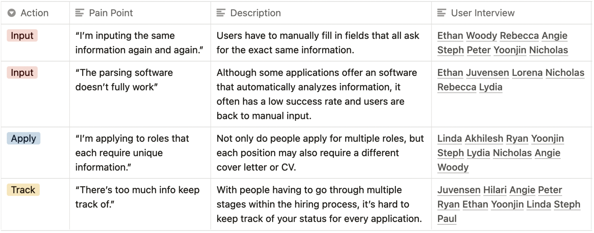
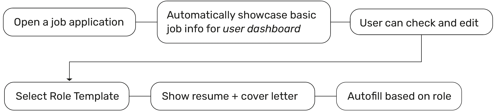
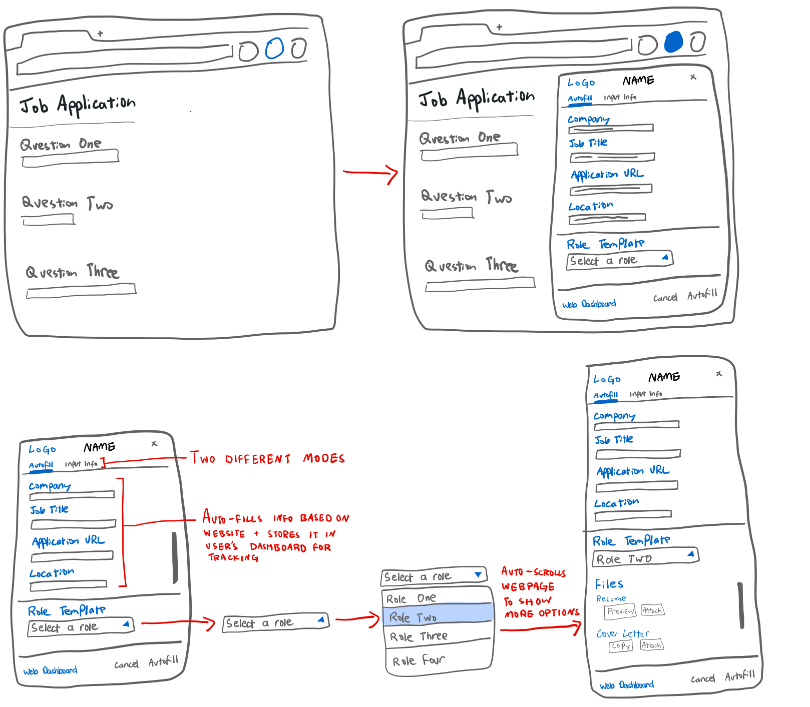
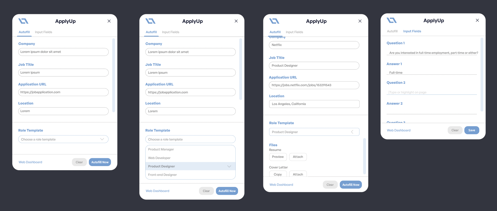
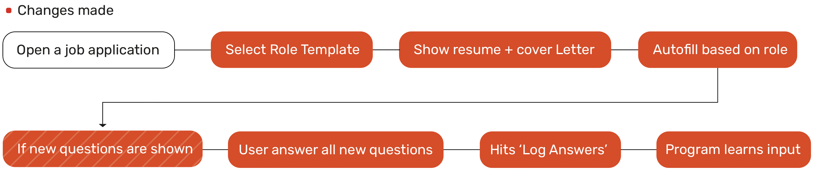
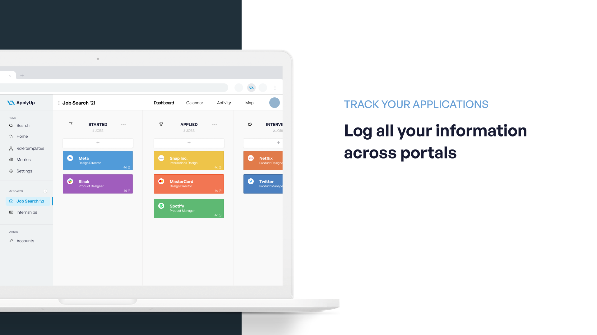

    

        <h3 id="intro"> PART 1: GENERATIVE RESEARCH </h3>
        <h2 id="mainhead align-items-left" style="padding-top:20px"> The Problem </h2>
        
 Job applications suck. 

        
They are time consuming, repetitive, and simply boring. The process involves manually entering the same info multiple times; most of these actions can be automated and streamlined to increase efficiency.

        <h2 id="mainhead align-items-left" style="padding-top:60px"> The Current Landscape</h2>
        
for Job and Internship Seekers

    

    

        

            
Up to 75%

        

        

            
of job applications are weeded out by ATS or applicant tracking systems before ever seen by a human.

        

    

    

        

            
21 - 80 applications

        

        

            
is how many an individual should submit to have highest probabiliy of receiving a job offer.

        

    

    

        

            
30 - 60 minutes

        

        

            
is the average amount of time most people prefer to spend on an application.

        

    

    

        <h2 id="mainhead align-items-left" style="padding-top:20px">User Interviews</h2>
        
To gain a deeper understanding of the problems people face while submitting a
        job application online, I conducted user interviews with 10 college students and
        5 graduates.There were 4 main painpoints:

    

    
    

        <h2 id="mainhead align-items-left" style="padding-top:30px">Our Solution</h2>
        
A web tool, starting as a Chrome extension for now, that <b><i>seamlessly recognizes</i></b> job application forms, <b><i>auto-completes</i></b> the most relevant fields, <b><i>customizes </i></b>cover letters and resumes, and <b><i>tracks submitted applications</i></b>.

    

    

        <h3 id="intro"> PART 2: INITIAL IDEATION </h3>
        
By consolidating everything I learned about the current job application landscape through user interviews, market research and first hand experience, I began ideating a possible solution.

        <h2 id="mainhead align-items-left" style="padding-top:20px"> User Journey </h2>
        
        <h2 id="mainhead align-items-left" style="padding-top:60px">Mid Fidelity Sketches & Screens</h2>
        
    

    

    

        <h2 id="mainhead align-items-left" style="padding-top:20px"> Design Issues </h2>
        
After creating a preliminary render of our product, I gave it to 8 users for feedback on the existing user flow and design. There were 3 key issues:

        

            <h4>1. Too Text Heavy</h4>
            
With ApplyUp primarily a Chrome extension, there is already very little screen real estate for users to work with. Thus, a text-heavy approach with small words and menus will only burden them further and make the process more difficult.

            <h4 style="padding-top:20px">2. Information in the Wrong Order</h4>
            
Although users also have trouble tracking their job applications, their main concern as shown from the user interviews is the need to auto-fill fields. Thus, it does not make the most sense to prompt users with basic job information first; instead, role templates should be shown first.

            <h4 style="padding-top:20px">3. Manual Input</h4>
            
Instead of selecting the ‘Input Fields’ option, highlighting or typing the question and writing the answer, it would be more efficient for users to just write the correct answer in the actual application field and have the program automatically learn it.

        

    

    

        <h3 id="intro"> PART 3: SECOND ITERATION </h3>
        <h2 id="mainhead align-items-left" style="padding-top:30px"> Ideation (Again) </h2>
        
This time, designing with <i><b>efficiency and accessibility in mind</b></i>.

        <h2 id="mainhead align-items-left" style="padding-top:20px"> User Journey </h2>
        
        <h2 id="mainhead align-items-left" style="padding-top:60px">Interface Development</h2>
        
    

    

        <h3 id="intro"> PART 4: FINAL DELIVERABLES </h3>
        <h2 id="mainhead align-items-left" style="padding-top:30px"> Final Prototypes</h2>
        
        
        
        
    

    

        <h2 id="mainhead align-items-left" style="padding-top:30px"> Design System </h2>
    

    
    

        <h2 id="mainhead align-items-left" style="padding-top:30px"> User Flow</h2>
        
        <h2 id="mainhead align-items-left" style="padding-top:30px; padding-bottom:20px"> Official Pitch Deck (static)</h2>
        <iframe src="img/ApplyUp.pdf" width="100%" height="600px"> </iframe>
    

    

        

            

                <h3 class="h3 heading">More Works</h3>
            

        

        

            

                <a href="halfway.html" class="item-wrap fancybox">
                    

                        <h3>Halfway There Van Frames</h3>
                        3D Rendering
                    

                    
                </a>
            

            

                <a href="caraxy.html" class="item-wrap fancybox">
                    

                        <h3>Caraxy</h3>
                        Branding
                    

                    
                </a>
            

            

                <a href="history.html" class="item-wrap fancybox">
                    

                        <h3>History At Your Footsteps</h3>
                        Design
                    

                    
                </a>
            

        

    

